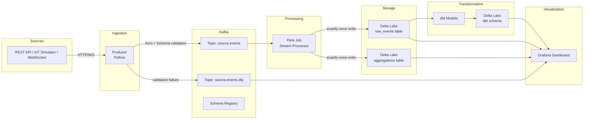

# Design Document: Real-Time Streaming Pipeline

## Overview

The Real-Time Streaming Pipeline is a portfolio project demonstrating modern data engineering patterns. It ingests live event data from configurable external sources, routes events through Apache Kafka, processes them with Apache Flink, persists results to a Delta Lake table storage layer, transforms data with dbt, and visualizes metrics in Grafana.

The system is designed to run entirely on a local machine via Docker Compose, making it reproducible and demonstrable without cloud infrastructure. The architecture emphasizes exactly-once processing semantics, schema enforcement, and observability throughout the pipeline.

### Technology Choices

| Component | Technology | Rationale |
|---|---|---|
| Message Broker | Apache Kafka (KRaft mode) | Industry-standard event streaming; KRaft removes Zookeeper dependency |
| Schema Registry | Confluent Schema Registry | Native Kafka integration; supports Avro with backward compatibility |
| Stream Processor | Apache Flink 1.18 | Native exactly-once semantics; rich windowing API; Kafka connector with transactional support |
| Table Store | Delta Lake (via Apache Spark) | ACID transactions; time-travel; Parquet-based; strong Python/SQL ecosystem |
| Transformation | dbt-core with dbt-spark adapter | SQL-first transformations; built-in data tests; schedulable |
| Visualization | Grafana | Provisioning-as-code; alerting; wide datasource support |
| Orchestration | Docker Compose | Single-command local setup; no cloud dependency |
| Language | Python (Producer, seed script), Java/Scala (Flink job) | Python for scripting; JVM for Flink ecosystem |

---

## Architecture



### Data Flow

1. The **Producer** polls an external source on a configurable interval and serializes each data point as an Avro-encoded Event, validated against the Schema Registry.
2. Valid events land on the source Kafka topic; invalid events are routed to the Dead Letter Queue (DLQ) topic.
3. The **Flink Stream Processor** consumes from the source topic, applies transformations, computes tumbling-window aggregations, and writes results to Delta Lake using two-phase commit (exactly-once).
4. **dbt** runs on a schedule, reading from `raw_events` and writing aggregated models to a dedicated schema.
5. **Grafana** queries Delta Lake (via Spark SQL or Trino) and renders dashboards with auto-refresh.

---

## Components and Interfaces

### Producer (`producer/`)

Responsibilities:
- Poll external source(s) at a configurable interval
- Serialize events to Avro using the Schema Registry client
- Publish to the correct Kafka topic (one per source type)
- Route invalid events to the DLQ with error metadata attached
- Implement exponential backoff on source connectivity failures
- Emit structured JSON logs

Key interfaces:
```python
class SourceAdapter(Protocol):
    def fetch(self) -> list[RawDataPoint]: ...

class KafkaPublisher:
    def publish(self, topic: str, event: Event) -> None: ...
    def publish_dlq(self, topic: str, event: Event, error: ValidationError) -> None: ...
```

Configuration (environment variables):
- `SOURCE_TYPE` — `rest_api | iot_simulator | websocket`
- `SOURCE_URL` — endpoint URL (REST/WebSocket) or ignored for simulator
- `KAFKA_BOOTSTRAP_SERVERS`
- `SCHEMA_REGISTRY_URL`
- `POLL_INTERVAL_MS` — default 1000

### Flink Stream Processor (`flink-job/`)

Responsibilities:
- Consume from Kafka using the Flink Kafka connector with consumer group offsets
- Parse and validate event payloads
- Assign event-time watermarks based on the `timestamp` field
- Compute tumbling-window aggregations (count/sum/avg) over a configurable window
- Write raw events and aggregations to Delta Lake using the Flink Delta connector with two-phase commit
- Expose a health HTTP endpoint on port 8081
- Save checkpoints to durable storage (local volume or S3-compatible)

Key Flink operators:
```
KafkaSource → WatermarkStrategy → ParseMap → KeyBy(source) → TumblingEventTimeWindow → AggregateFunction → DeltaSink
                                            ↘ DeltaSink (raw_events)
```

Configuration:
- `KAFKA_BOOTSTRAP_SERVERS`
- `KAFKA_TOPIC`
- `WINDOW_SIZE_SECONDS` — default 60, range 10–300
- `CHECKPOINT_INTERVAL_MS` — default 10000
- `DELTA_TABLE_PATH`

### Schema Registry

Uses Confluent Schema Registry (Docker image). Schemas are registered at startup via an init container that calls the REST API. Each topic has a subject `<topic>-value` with an Avro schema.

### Delta Lake Storage (`storage/`)

Managed via PySpark or the Delta Standalone library. Tables:
- `raw_events` — partitioned by `source` and `date`
- `aggregations` — partitioned by `source` and `window_start`

Access pattern: Flink writes via the Delta-Flink connector; dbt reads/writes via Spark SQL; Grafana queries via Spark Thrift Server or Trino.

### dbt Models (`dbt/`)

- `models/staging/stg_raw_events.sql` — light cleaning of `raw_events`
- `models/marts/events_per_minute.sql` — per-source event counts per minute
- `tests/` — not-null, unique, and range assertions on `event_id` and `timestamp`

Scheduler: cron job inside Docker Compose running `dbt run && dbt test` every 5 minutes.

### Grafana (`grafana/`)

Provisioned via `grafana/provisioning/`:
- `datasources/delta.yaml` — Spark Thrift Server or Trino datasource
- `dashboards/pipeline.json` — dashboard definition
- Alert rule for DLQ count > 10 in 5 minutes

### Seed Script (`scripts/seed.py`)

Generates synthetic events conforming to the Avro schema and publishes them directly to Kafka, bypassing the external source. Used for local demo without API keys.

### Reprocessing Utility (`scripts/reprocess_dlq.py`)

Reads from the DLQ topic, attempts schema correction, and republishes to the original topic. Logs each reprocessed event.

---

## Data Models

### Event (Avro Schema)

```json
{
  "type": "record",
  "name": "Event",
  "namespace": "com.pipeline",
  "fields": [
    { "name": "event_id",  "type": "string" },
    { "name": "source",    "type": "string" },
    { "name": "timestamp", "type": "string" },
    { "name": "payload",   "type": { "type": "map", "values": "string" } }
  ]
}
```

### DLQ Envelope (Avro Schema)

```json
{
  "type": "record",
  "name": "DLQEvent",
  "namespace": "com.pipeline",
  "fields": [
    { "name": "original_topic",     "type": "string" },
    { "name": "original_partition", "type": "int" },
    { "name": "original_offset",    "type": "long" },
    { "name": "error_type",         "type": "string" },
    { "name": "error_message",      "type": "string" },
    { "name": "raw_bytes",          "type": "bytes" }
  ]
}
```

### Delta Lake: `raw_events` Table

| Column | Type | Notes |
|---|---|---|
| `event_id` | STRING | UUID, primary dedup key |
| `source` | STRING | Partition column |
| `timestamp` | TIMESTAMP | Event-time; partition date derived from this |
| `date` | DATE | Partition column, derived from `timestamp` |
| `payload` | MAP<STRING,STRING> | Raw key-value payload |
| `ingested_at` | TIMESTAMP | Kafka ingestion time |

### Delta Lake: `aggregations` Table

| Column | Type | Notes |
|---|---|---|
| `window_start` | TIMESTAMP | Start of tumbling window |
| `window_end` | TIMESTAMP | End of tumbling window |
| `source` | STRING | Partition column |
| `event_count` | BIGINT | Count of events in window |
| `metric_sum` | DOUBLE | Sum of numeric payload value (if applicable) |
| `metric_avg` | DOUBLE | Average of numeric payload value |
| `written_at` | TIMESTAMP | Write time |

### dbt Output: `events_per_minute`

| Column | Type |
|---|---|
| `minute` | TIMESTAMP |
| `source` | STRING |
| `event_count` | BIGINT |

---

## Correctness Properties

*A property is a characteristic or behavior that should hold true across all valid executions of a system — essentially, a formal statement about what the system should do. Properties serve as the bridge between human-readable specifications and machine-verifiable correctness guarantees.*

### Property 1: Event serialization round-trip

*For any* valid Event object, serializing it to Avro using the Schema Registry client and then deserializing it should produce an object equal to the original.

**Validates: Requirements 1.5, 2.2**

---

### Property 2: One event published per data point

*For any* valid source response containing N data points, the Producer shall publish exactly N events to the Kafka topic.

**Validates: Requirements 1.3**

---

### Property 3: Source-to-topic routing

*For any* set of configured source types and any event produced by a source, the event shall be published to the Kafka topic whose name matches that source type.

**Validates: Requirements 1.6**

---

### Property 4: Invalid events are routed to the DLQ with complete metadata

*For any* event that fails schema validation, the event shall appear on the DLQ topic and the DLQ message shall contain all required metadata fields: `original_topic`, `original_partition`, `original_offset`, `error_type`, and `error_message`.

**Validates: Requirements 2.3, 8.2**

---

### Property 5: Schema backward compatibility round-trip

*For any* event serialized with schema version V, deserializing it using schema version V+1 (where V+1 is a backward-compatible update) shall succeed and preserve all field values present in V.

**Validates: Requirements 2.5**

---

### Property 6: Windowed aggregation correctness and emission

*For any* set of events assigned to a tumbling window of any valid size (10–300 seconds), when the watermark advances past the window boundary, the emitted aggregation result (count, sum, average) shall equal the mathematically correct value computed over those events.

**Validates: Requirements 3.3, 3.4**

---

### Property 7: Checkpoint recovery preserves exactly-once semantics

*For any* sequence of events where a failure occurs mid-stream, restarting the Stream Processor from the last successful checkpoint shall produce a final Table Store state identical to uninterrupted processing — no events duplicated, no events dropped.

**Validates: Requirements 3.7, 4.1, 4.2**

---

### Property 8: Exactly-once write count

*For any* stream of events (including duplicates) published to Kafka within a time window, the number of records written to the Table Store for that window shall equal the number of unique `event_id` values in the stream.

**Validates: Requirements 4.3, 4.4, 4.5**

---

### Property 9: Table Store time-travel correctness

*For any* sequence of write operations to the Table Store, querying the table at version V shall return exactly the data that was present after the V-th write, regardless of subsequent writes.

**Validates: Requirements 5.3, 5.4**

---

### Property 10: Partition correctness

*For any* event written to the `raw_events` table, the event shall appear in the partition corresponding to its `source` value and the date derived from its `timestamp`.

**Validates: Requirements 5.5**

---

### Property 11: dbt run does not modify raw_events

*For any* dbt run over any input dataset, the `raw_events` table shall have the same row count and content hash before and after the run.

**Validates: Requirements 6.2**

---

### Property 12: dbt data tests detect violations

*For any* dataset containing at least one null `event_id`, duplicate `event_id` within a partition, or `timestamp` outside the valid range, the dbt data tests shall fail and report the violating test name and row count.

**Validates: Requirements 6.3, 6.4**

---

### Property 13: DLQ reprocessing round-trip

*For any* event in the DLQ that is correctable (i.e., its schema violation can be fixed), running the reprocessing utility shall result in that event appearing on the original Kafka topic with a valid schema.

**Validates: Requirements 8.5**

---

### Property 14: Structured log format

*For any* log-triggering operation in the Producer, Stream Processor, or dbt runner, the emitted log line shall be valid JSON containing at minimum the fields: `timestamp`, `component`, `level`, and `message`.

**Validates: Requirements 9.1**

---

### Property 15: Missing environment variable causes descriptive failure

*For any* required environment variable that is absent at component startup, the component shall exit with a non-zero status code and the log output shall contain a message identifying the name of the missing variable.

**Validates: Requirements 10.5**

---

## Error Handling

### Producer

- **Source unreachable**: Exponential backoff starting at 1 s, doubling up to 60 s max. Structured error log on each retry attempt. After 30 s of unreachability, log at ERROR level.
- **Schema validation failure**: Route event to DLQ with full metadata envelope. Log at WARN level with offending field and value. Continue processing subsequent events.
- **Kafka publish failure**: Retry up to 3 times with 500 ms delay. If all retries fail, log at ERROR and drop the event (acceptable for portfolio scope; production would use a local buffer).
- **Missing env var at startup**: Log descriptive error identifying the variable name, exit with code 1.

### Flink Stream Processor

- **Malformed event payload**: Catch parse exceptions in the `ParseMap` operator, route to DLQ, increment a `parse_errors` counter metric.
- **Delta Lake write failure**: Flink's two-phase commit protocol handles this — the transaction is aborted and the checkpoint is not committed, so Flink will retry from the previous checkpoint.
- **Checkpoint timeout**: If a checkpoint does not complete within 30 s, Flink logs a warning and retries. After 3 consecutive failures, the job transitions to FAILED state and the health endpoint returns 503.
- **Kafka consumer lag**: Exposed as a Prometheus metric. No automatic action; operator is expected to scale or investigate.

### dbt

- **Data test failure**: dbt exits with non-zero status code. The scheduler (cron/Airflow) captures this and can alert. Logs include test name and failing row count.
- **Source table missing**: dbt compilation fails with a clear error message identifying the missing relation.

### Delta Lake

- **Aborted transaction**: Delta Lake's transaction log ensures atomicity. Partial writes are cleaned up by the next successful write or by `VACUUM`.
- **Concurrent write conflict**: Delta Lake uses optimistic concurrency control. Conflicting writes raise a `ConcurrentModificationException`; the caller should retry.

---

## Testing Strategy

### Unit Tests

Focus on pure logic that can be tested in isolation:

- **Producer**: Source adapter parsing logic, event construction, DLQ envelope construction, exponential backoff interval calculation.
- **Flink job**: Aggregation function logic (count/sum/avg), watermark assignment logic, deduplication state logic.
- **dbt**: SQL model correctness via dbt's built-in test framework against a local DuckDB or Spark instance.
- **Reprocessing utility**: Schema correction logic, topic routing logic.

Use example-based tests for specific scenarios (startup timing, health endpoint states, seed script output).

### Property-Based Tests

Use [Hypothesis](https://hypothesis.readthedocs.io/) (Python) for Producer and utility tests, and [jqwik](https://jqwik.net/) (Java) for Flink job tests.

Each property test runs a minimum of **100 iterations**.

Tag format: `# Feature: real-time-streaming-pipeline, Property {N}: {property_text}`

| Property | Component | Library | Key Generators |
|---|---|---|---|
| 1 — Serialization round-trip | Producer | Hypothesis | Random Event objects |
| 2 — Events per data point | Producer | Hypothesis | Random source responses (1–100 data points) |
| 3 — Source-to-topic routing | Producer | Hypothesis | Random sets of source types |
| 4 — DLQ metadata completeness | Producer | Hypothesis | Random invalid events (missing/wrong-type fields) |
| 5 — Schema backward compatibility | Producer | Hypothesis | Random v1 events |
| 6 — Windowed aggregation correctness | Flink job | jqwik | Random event sets, random window sizes 10–300 s |
| 7 — Checkpoint recovery | Flink job | jqwik | Random event sequences with injected failures |
| 8 — Exactly-once write count | Flink job | jqwik | Random streams with 0–50% duplicate event_ids |
| 9 — Time-travel correctness | Storage layer | Hypothesis | Random write sequences (1–20 batches) |
| 10 — Partition correctness | Storage layer | Hypothesis | Random events with varied sources and timestamps |
| 11 — dbt immutability | dbt | Hypothesis | Random raw_events datasets |
| 12 — dbt test violation detection | dbt | Hypothesis | Random datasets with injected violations |
| 13 — DLQ reprocessing round-trip | Reprocessing utility | Hypothesis | Random DLQ events (correctable and uncorrectable) |
| 14 — Structured log format | All components | Hypothesis | Random log-triggering operations |
| 15 — Missing env var failure | All components | Hypothesis | Random subsets of required env vars |

### Integration Tests

Run against a local Docker Compose environment (subset of services):

- Consumer group offset commitment after processing
- Checkpoint state files appear in storage within 30 s
- Prometheus metrics endpoint returns correct format and metric names
- Concurrent Delta Lake reads/writes produce consistent results
- Grafana dashboard refreshes within 60 s of new data
- `docker compose up` brings all services healthy within 3 minutes

### Smoke Tests

Run at startup / CI to verify configuration:

- Schema Registry has a registered schema for each topic
- Event Avro schema contains required fields (`event_id`, `source`, `timestamp`, `payload`)
- DLQ topic exists with `retention.ms` ≥ 259,200,000 (72 hours)
- Grafana provisioning files exist; dashboard JSON contains required panel titles and alert rule
- `docker-compose.yml` contains all required service definitions
- `README.md` exists with required sections
