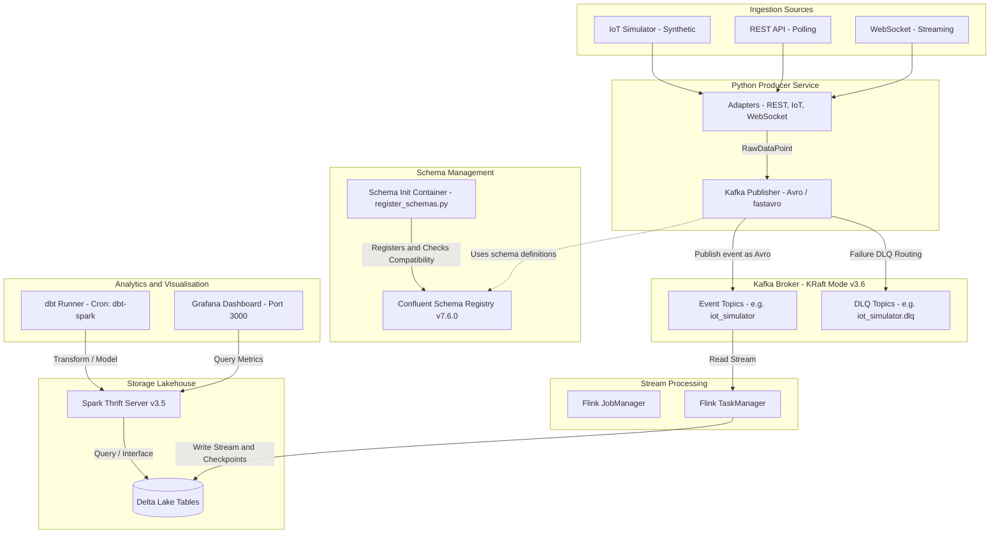

# Real-Time Streaming Pipeline

A robust, containerised real-time data streaming and processing pipeline. This architecture ingests data from multiple source adapters (IoT sensors, REST APIs, WebSockets), serializes messages into Avro format with schema compatibility validation, streams them through Kafka and Apache Flink, stores them in Delta Lake via a Spark Thrift server, transforms the data using dbt, and visualises the results in Grafana.

---

## 🏗️ System Architecture

The following diagram illustrates the flow of data through the ingestion, messaging, processing, storage, and visualisation layers:



---

## 🛠️ Project Structure & Status

The repository layout is structured into logical components, separating ingestion, streaming, storage, transformations, and dashboards.

```
streaming_pipeline/
├── producer/               # Python producer service & adapters (Completed)
│   ├── adapters/           # IoT, REST, and WebSocket adapters
│   └── publisher.py        # Avro serialization & Kafka publishing
├── schemas/                # Avro schema definitions (Completed)
│   ├── event.avsc          # Main event schema
│   └── dlq_event.avsc      # Dead Letter Queue schema
├── scripts/                # Schema registration & utility scripts (Completed)
├── tests/                  # Unit, Integration, & Property tests (Completed)
├── docker-compose.yml      # Multi-container environment (Completed)
├── .env.example            # Environment template (Completed)
├── flink-job/              # Apache Flink stream processor (Scaffolded)
├── dbt/                    # dbt transformation models (Scaffolded)
└── grafana/                # Grafana dashboards & datasources (Scaffolded)
```

### Component Status Matrix

| Component | Status | Technologies Used | Description |
|---|---|---|---|
| **Infrastructure** | ✅ Completed | Docker Compose, Bitnami Kafka, Schema Registry | Single-command local environment in KRaft mode |
| **Schema Registry** | ✅ Completed | Confluent Schema Registry, Python, requests | Automatic schema registration and backward compatibility checks |
| **Ingestion Producer** | ✅ Completed | Python 3.11, fastavro, requests, websockets | Resilient multi-protocol ingestion adapters with retries and DLQ |
| **Testing Suite** | ✅ Completed | pytest, hypothesis | Extensive unit tests and property-based verification |
| **Stream Processing** | 🏗️ Scaffolded | Apache Flink 1.18 (Scala/Java) | Flink JobManager & TaskManager setup (Job code is ready to be written) |
| **Lakehouse Storage** | 🏗️ Scaffolded | Delta Lake, Spark Thrift Server 3.5 | Storage volumes configured; SQL querying setup |
| **Transformations** | 🏗️ Scaffolded | dbt-spark, Cron | Scheduler container configured for transformation runs |
| **Visualisation** | 🏗️ Scaffolded | Grafana | Provisioning configs scaffolded for dashboards & datasources |

---

## ⚙️ Environment Configuration

The pipeline reads configuration variables from a `.env` file at the root. Copy the template to start:

```bash
cp .env.example .env
```

Key environment variables are grouped as follows:

| Group | Variable | Default / Description |
|---|---|---|
| **Kafka** | `KAFKA_BOOTSTRAP_SERVERS` | `kafka:9092` (Internal Docker network) |
| | `KAFKA_CLUSTER_ID` | KRaft Cluster ID |
| **Schema Registry** | `SCHEMA_REGISTRY_URL` | `http://schema-registry:8081` |
| **Producer** | `SOURCE_TYPE` | `iot_simulator` (Options: `iot_simulator`, `rest_api`, `websocket`) |
| | `SOURCE_URL` | Endpoint URL (for `rest_api` / `websocket` adapters) |
| | `POLL_INTERVAL_MS` | `1000` (Ingestion polling frequency) |
| **Flink** | `WINDOW_SIZE_SECONDS` | Stream aggregation window size |
| | `CHECKPOINT_INTERVAL_MS`| `10000` (Flink checkpointing frequency) |
| **dbt & Spark** | `DBT_SPARK_HOST` | `spark-thrift` |
| | `DBT_CRON_SCHEDULE` | `*/5 * * * *` (Cron expression for dbt runs) |
| **Grafana** | `GF_SECURITY_ADMIN_PASSWORD` | `changeme` |

---

## 🚀 Getting Started

### Prerequisites
- Docker & Docker Compose (v2.0+)
- Python 3.11+ (if running tests or producer locally)

### Step 1: Start the Environment
Run the compose setup. The `--wait` flag ensures that containers start in the correct dependency order and checks their health before returning control to the terminal.

```bash
docker compose up --wait
```

### Step 2: Verify Schema Registry
The `schema-init` container automatically registers your Avro schemas on startup. Check that both schemas are registered successfully:

```bash
curl http://localhost:8081/subjects
```
**Expected response:**
```json
["events-value", "events.dlq-value"]
```

---

## 🐍 Ingestion Producer & Resiliency

The Python producer is modular, utilizing the **Strategy Pattern** to swap ingestion protocols seamlessly.

### 1. Ingestion Adapters
- **`IoTSimulatorAdapter`**: Generates synthetic telemetry data points (temperature, humidity, pressure). Ideal for local sandboxing.
- **`RestApiAdapter`**: Polls a configured HTTP REST endpoint.
- **`WebSocketAdapter`**: Connects to a WebSocket stream to consume real-time messages.

### 2. Backoff Resiliency
Both network-bound adapters (`RestApiAdapter` and `WebSocketAdapter`) implement **exponential backoff** to handle network hiccups and target downtime:
- Starts at `1` second.
- Doubles on each failure (e.g., `1s`, `2s`, `4s`, `8s`, ...).
- Caps at `60` seconds.
- Resets back to `1` second immediately upon the first successful connection or fetch.

### 3. Serialization and Schema Management
- **Local Serialization**: The producer uses `fastavro` (schemaless writer) for high-performance Avro serialization without querying the Schema Registry for every message.
- **Auto-Registration**: The `register_schemas.py` script validates **backward compatibility** against the latest registered schema version before upgrading schemas, preventing breaking changes in the pipeline.

### 4. Dead Letter Queue (DLQ) & Retry Policy
Delivery to Kafka is protected by a retry loop:
- Up to **3 retries** at **500 ms intervals** on connection or broker failures.
- If all 3 attempts fail, or if a message violates Avro validation:
  1. The event is wrapped in a `DLQEvent` envelope containing the original topic, partition, offset, error details, and the raw message bytes.
  2. The message is serialized via the DLQ schema and pushed to `<original-topic>.dlq` (e.g., `iot_simulator.dlq`).
  3. DLQ topic messages are configured with a **72-hour retention period** to allow ample time for manual inspection and replay.

---

## 🧪 Testing and Quality Assurance

The codebase includes a rich suite of tests. It combines standard unit tests with **Property-Based Testing** using **Hypothesis** to verify pipeline invariants.

### 1. Property-Based Test Invariants
- **Property 1 (`test_property_1_serialization_roundtrip.py`)**: Asserts that random event payloads serialized to Avro can be deserialized back into identical Python dictionary representations.
- **Property 2 (`test_property_2_events_per_data_point.py`)**: Verifies that the publisher produces exactly one event for every data point fetched.
- **Property 3 (`test_property_3_source_topic_routing.py`)**: Asserts that events are dynamically routed to the Kafka topic named after the source adapter type.
- **Property 4 (`test_property_4_dlq_metadata.py`)**: Validates that all failed events routed to the DLQ contain complete and non-empty metadata fields (original topic, offset, error details, original raw payload).
- **Property 5 (`test_property_5_schema_backward_compat.py`)**: Simulates schema evolution and verifies that fields added to the schema are backward compatible.

### 2. Running the Tests
To run all unit and property tests locally, install the test dependencies and run `pytest`:

```bash
pip install -r requirements-test.txt
pytest -v
```

---

## 📈 Next Steps & Implementation Milestones

To extend this pipeline, complete the following development phases:

1. **Flink Application (`flink-job/`)**:
   - Write a Flink stream processing job in Java, Scala, or PyFlink.
   - Consume from Kafka, apply time-windowed aggregations, and sink output data directly to Delta Lake.
2. **dbt SQL Transformations (`dbt/`)**:
   - Configure your `dbt_project.yml` pointing to the Spark Thrift server.
   - Write SQL models to perform dimensional modeling (e.g., aggregations, trend tables) on the raw Delta Lake tables.
3. **Grafana Dashboards (`grafana/`)**:
   - Provision a Spark SQL/Thrift datasource in `grafana/provisioning/datasources/`.
   - Export dashboard JSONs into `grafana/provisioning/dashboards/` to visualize analytics in real-time.
